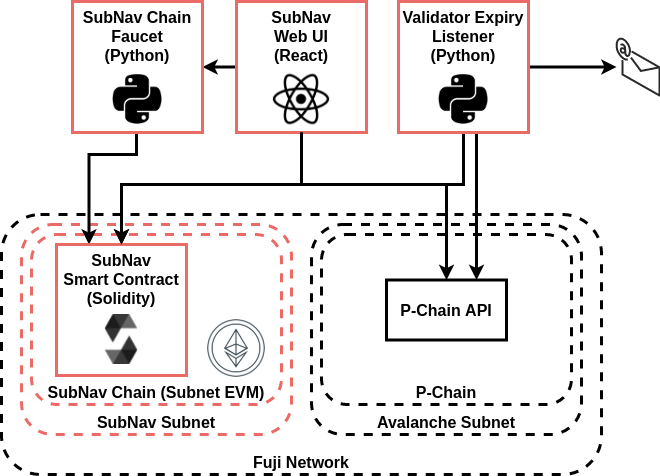

# SubNav: The Subnet Navigator

The Subnet Navigator (SubNav) is a service built on [Avalanche](https://avax.network) that aims at bringing together [subnet](https://support.avax.network/en/articles/4064861-what-is-a-subnet) owners and [validators](https://support.avax.network/en/articles/4064704-what-is-a-blockchain-validator).

SubNav is deployed on the Fuji network and the web UI is available at https://subnav.network.

**Note:** This project was built over a weekend as part of the [Avalanche Summit Hackathon](https://hackathon.avalanchesummit.com/).

## Project Repositories

The SubNav source code is composed of multiple repositories:

- [contracts](https://github.com/Avackathon/contracts): Solidity contracts backing the SubNav project.
- [frontend](https://github.com/Avackathon/frontend): React WebApp of the SubNav project.
- [infra](https://github.com/Avackathon/infra): Ansible environment used to manage the Fuji validator, Fuji subnet and EVM blockchain backing the SubNav project.
- [faucet](https://github.com/Avackathon/faucet): Simple FastAPI Python backend to quickly fund wallets with `$SUB` tokens, the native token of the SubNav subnet.
- [notification-service](https://github.com/Avackathon/notification-service/): A Python script to alert Subnet owners and Validators when their validating periods approach the end.

## Initial Project Idea

The initial idea was to build a fully decentralized way of:

- Creating a public user profile (name, email and Twitter handle)
- **Claiming ownership** of subnets and validators
- **Adding metadata** to subnets and blockchains that you own (e.g. a subnet name, description and rewards, type of VM)
- **Requesting to be added as a validator** to a subnet
- **Accepting a validator request** to join your subnet
- **Receive notifications** upon validator expiration
- As a non-registered user, exploring existing subnets and blockchains and easily import networks to wallets

To achieve this, **all the data** related to users, subnets, blockchains and validators will be stored on a **dedicated blockchain** (based on the [Subnet EVM](https://github.com/ava-labs/subnet-evm)) validated by dedicated [subnet](https://support.avax.network/en/articles/4064861-what-is-a-subnet) powered by Avalanche.

To ensure maximum security **we cannot store the user private keys**. The subnet and validator ownership can be verified by **signing a message on the P-Chain** containing the owner EVM address. The signature can then be validated by SubNav by an off-chain service or even by a [stateful precompile](https://medium.com/avalancheavax/customizing-the-evm-with-stateful-precompiles-f44a34f39efd).

## Current Project Features

- **Anyone** can:

  - Use [SubNav](https://subnav.network) to list subnets and blockchains currently on Fuji
  - Connect to the SubNav chain, get an airdrop of `$SUB` and create a user account using [Metamask](https://metamask.io/)

- A **Subnet owner** can:

  - Claim a Subnet on SubNav
  - Enrich its metadata. These metadata are stored on-chain in a [smart contract](https://github.com/Avackathon/contracts/blob/master/contracts/SubNav.sol). This smart contract lives in a special Subnet called the **SubNav Subnet** running an instance of the [Subnet EVM](https://github.com/ava-labs/subnet-evm).

## SubNav Subnet and Blockchain info

On Fuji:

- SubNav subnet:
  - ID: `hZFzPzQMPwzmujE7U6dtCPqPk39x75vS4Vq3Rsw5p2pZcsXEN`
  - Validators:
    - `NodeID-Czk2sjkBvgjf9wwqQoFUurVYbDgpcTAKo`: `weight=20`
- SubNav Chain:
  - Blockchain ID: `2JXduejPx6J6RkHmVZgGDBV11drsAM4GToRMyuP68XNjrhheKK`
  - Chain RPC: [https://fuji.subnav.network/ext/bc/subnav/rpc](https://fuji.subnav.network/ext/bc/subnav/rpc)
  - Chain ID: `13213`
  - Token: `SUB`

## Architecture



### SubNav Subnet

The **SubNav Subnet** is a Fuji network subnet validated by `NodeID-Czk2sjkBvgjf9wwqQoFUurVYbDgpcTAKo` created for the purpose of the SubNav project.

### SubNav Chain

The **SubNav Chain** is a blockchain running on the **SubNav Subnet**. It is an instance of the [Subnet EVM](https://github.com/ava-labs/subnet-evm) and is available at the following RPC:

```
url: "https://fuji.subnav.network/ext/bc/subnav/rpc"
chainId: 13213
```

### SubNav Smart Contract

The SubNav contract is a Solidity smart contract deployed on the **SubNav EVM**. It is used to store metadatas about the subnets and their owners.

## TODO

There are still some features we did not have the time to implement:

- The SubNav frontend currently only lists subnets and blockchains, we would like to implement lists of validators and VMs next.
- The notification service does not email users yet, it only lists the leasing periods.
- The notification service should only apply to subnets and users that are registered on SubNav.
- The smart contract should be enriched to:
  - Support validator ownership
  - Enforce P-Chain address ownership verification. This will be done by allowing users to add a signature of their EVM address with their P-Chain address, and this signature will be checked either off-chain or via a stateful precompile.
